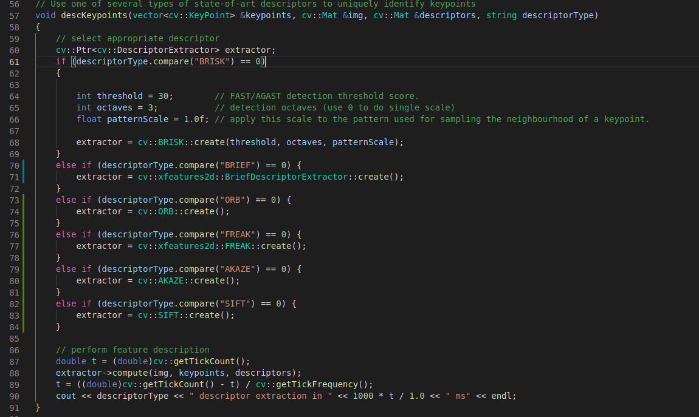
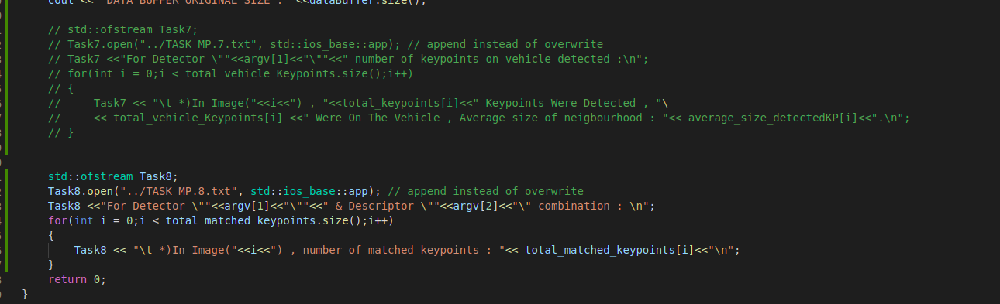

### MP.1 Data Buffer Optimization
I implemented the data buffer as a vector which has 2 places , starts initially with loading first image , and if there was a place for second image , it would load it , any image after that , it will first remove the first image to make space , then add the new image.

### MP.2 Keypoint Detection
I implemented the detectors HARRIS, FAST, BRISK, ORB, AKAZE, and SIFT and made them selectable by setting a string called ("detectorType").

### MP.3 Keypoint Removal
I removed all keypoints outside this vehicle rectangle and kept only the ones inside it.

  
### MP.4 Keypoint Descriptors
I implemented the descriptors BRIEF, ORB, FREAK, AKAZE and SIFT and made them selectable using string ("descriptorType").

  
### MP.5 Descriptor Matching
Implemented FLANN matching as well as k-nearest neighbor selection similar to last section's task implementation . Both methods must be selectable using the respective strings in the main function ("matcherType") & ("selectorType") respectively.

### MP.6 Descriptor Distance Ratio
comparied the best and second best matched to decide if a pair of matched keypoints should be stored.

### MP.7  Performance Evaluation 1
Wrote an automated python script with a list of supported detectors that loops and calls the binary of the project , I added also a part at the end of the proejct's code to write the output into a text file.

### MP.8 Performance Evaluation 2
Count the number of matched keypoints for all 10 images using all possible combinations of detectors and descriptors. In the matching step, the BF approach is used with the descriptor distance ratio set to 0.8 :

I made a python script with lists of descriptors and detectors that would call the project code and pass to it all the possible combinations for detectors + descriptors and save the output in a MP8.txt file as shown.

### MP.9 Performance Evaluation 3
I implemented python script Task_MP9.py to try all the different descriptors/detectors compinations ,to calculate time for extractiong & detection , I created a variable called average time , passed it by refrence to all the descriptor and detector functions , calculated the time take by them and added it to the average time , then divided it by the number of images to get the average time each combination took , the result is saved in an excel sheet to be easily arranged.

According to my calculations , I would say the top three Detector/Descriptor combinations are:

1. **FAST + BRIEF**
2. **FAST + ORB**
3. **FAST/FREAK**

